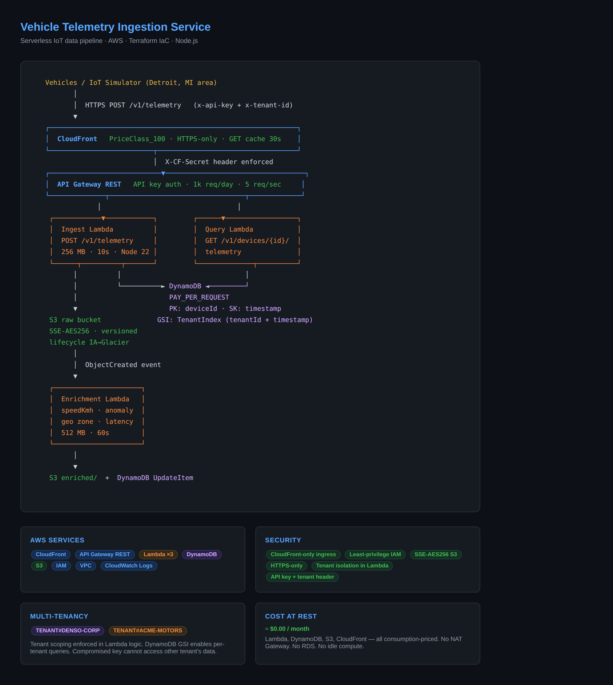
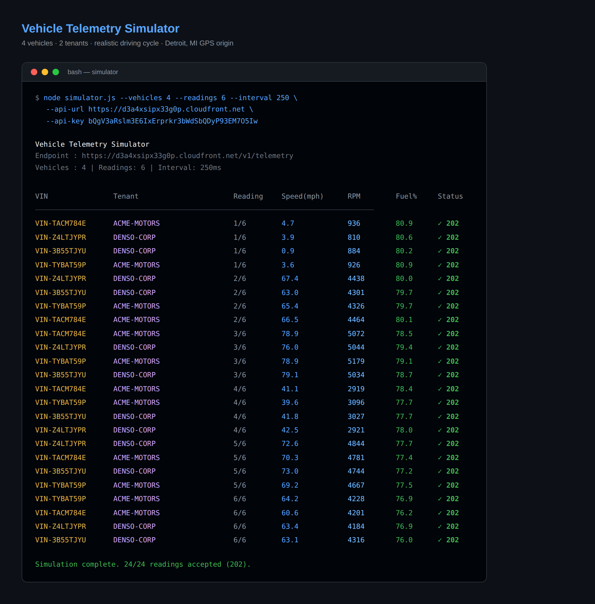
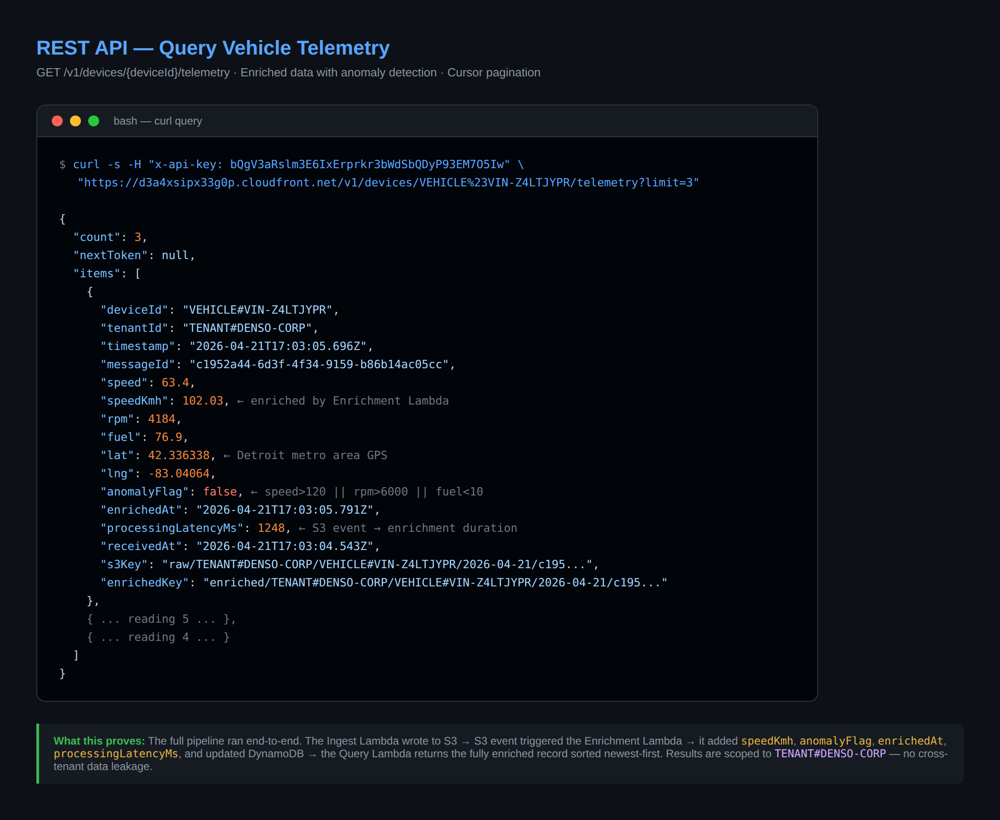
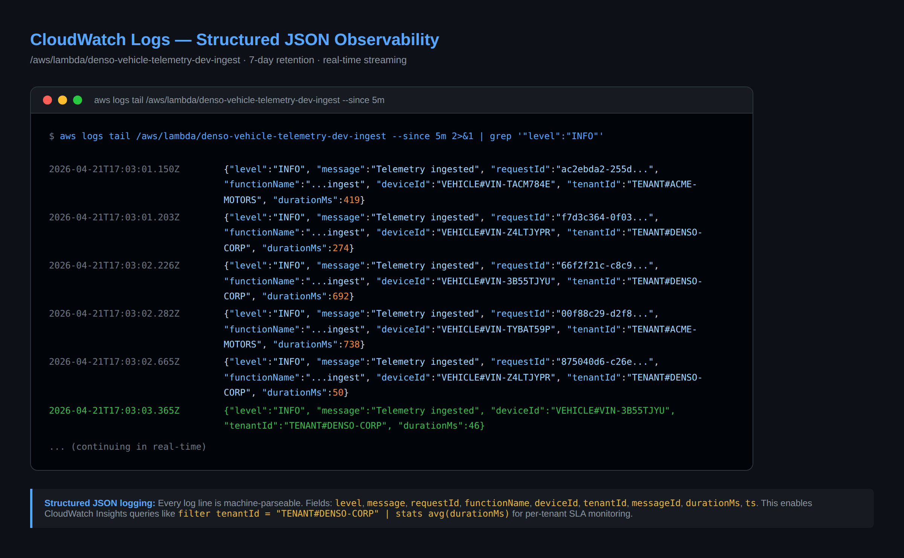
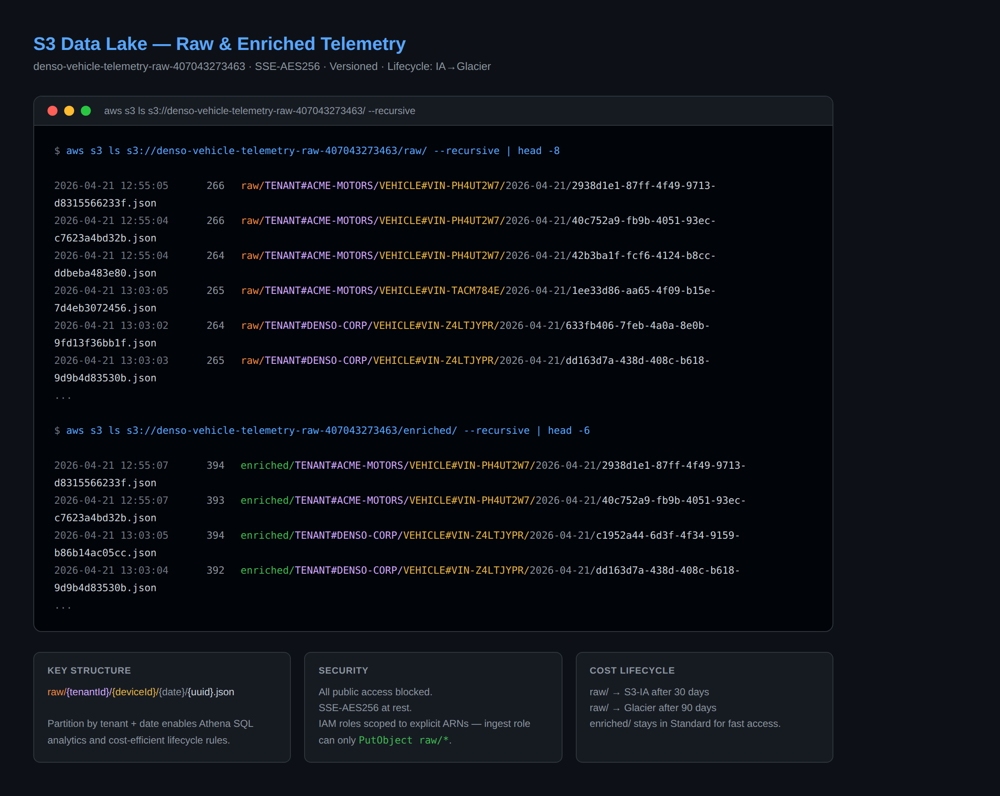
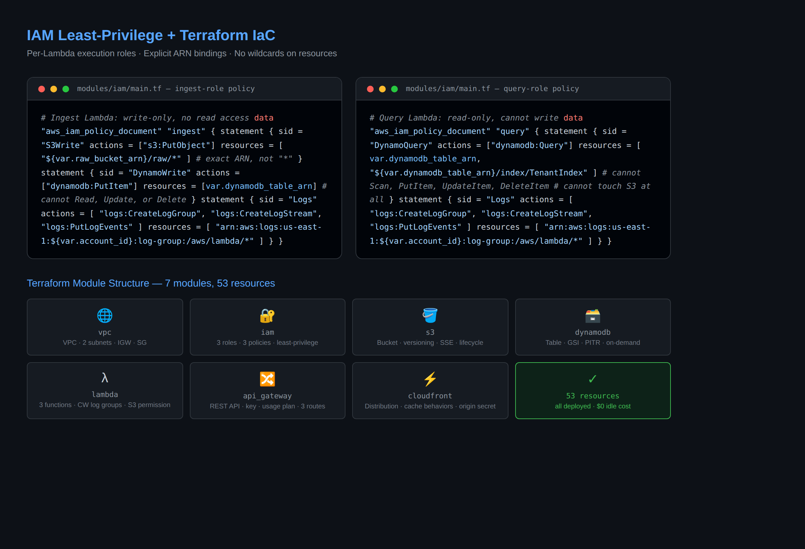

# Vehicle Telemetry Ingestion Service


A serverless IoT data pipeline on AWS that ingests real-time vehicle telemetry from embedded sensors, stores and enriches it automatically, and serves it via a secure multi-tenant REST API. All infrastructure defined in Terraform.

---

## Architecture

```
  Vehicles / IoT Simulator  (Detroit, MI area GPS)
          │
          │  HTTPS POST /v1/telemetry  (x-api-key + x-tenant-id)
          ▼
  ┌────────────────────────────────────────────────────────────────┐
  │  CloudFront   PriceClass_100 · HTTPS-only · GET cache 30s     │
  └──────────────────────────┬─────────────────────────────────────┘
                             │  X-CF-Secret origin header enforced
  ┌────────────────────────────▼───────────────────────────────────┐
  │  API Gateway REST   API key auth · 1k req/day · 5 req/sec     │
  └──────────────┬──────────────────────────────┬─────────────────┘
                 │                              │
   ┌─────────────▼──────────┐      ┌────────────▼─────────────────┐
   │  Ingest Lambda          │      │  Query Lambda                │
   │  POST /v1/telemetry     │      │  GET /v1/devices/{id}/       │
   │  256 MB · 10s · Node 22 │      │       telemetry              │
   └──────┬──────────┬───────┘      └────────────┬─────────────────┘
          │          │                            │
          │          └──────────► DynamoDB ◄──────┘
          │                       PAY_PER_REQUEST
          ▼                       PK: deviceId · SK: timestamp
   S3 raw bucket                  GSI: TenantIndex (tenantId + ts)
   SSE-AES256 · versioned
   lifecycle IA→Glacier
          │
          │  ObjectCreated event
          ▼
   ┌──────────────────────┐
   │  Enrichment Lambda   │
   │  speedKmh · anomaly  │
   │  geo zone · latency  │
   │  512 MB · 60s        │
   └──────────────────────┘
          │
          └──► S3 enriched/  +  DynamoDB UpdateItem
```

---

## Screenshots

### Architecture
[](docs/screenshots/01-architecture.html)

### Simulator — 24/24 Readings Accepted
[](docs/screenshots/02-simulator.html)

### REST API — Enriched Telemetry Response
[](docs/screenshots/03-api-query.html)

### CloudWatch Logs — Structured JSON
[](docs/screenshots/04-cloudwatch-logs.html)

### S3 Data Lake — raw/ and enriched/ Prefixes
[](docs/screenshots/05-s3-data-lake.html)

### IAM Least-Privilege + Terraform Module Map
[](docs/screenshots/06-iam-terraform.html)

---

## Simulator Output

```
Vehicle Telemetry Simulator
Endpoint : https://d3a4xsipx33g0p.cloudfront.net/v1/telemetry
Vehicles : 4  |  Readings: 6  |  Interval: 250ms

VIN           Tenant                Reading  Speed(mph)  RPM     Fuel%   Status
--------------------------------------------------------------------------------
VIN-TACM784E  ACME-MOTORS           1/6      4.7         936     80.9    ✓ 202
VIN-Z4LTJYPR  DENSO-CORP            1/6      3.9         810     80.6    ✓ 202
VIN-3B55TJYU  DENSO-CORP            1/6      0.9         884     80.2    ✓ 202
VIN-TYBAT59P  ACME-MOTORS           1/6      3.6         926     80.9    ✓ 202
VIN-Z4LTJYPR  DENSO-CORP            2/6      67.4        4438    80.0    ✓ 202
VIN-TACM784E  ACME-MOTORS           3/6      78.9        5072    78.5    ✓ 202
VIN-Z4LTJYPR  DENSO-CORP            4/6      42.5        2921    78.0    ✓ 202
VIN-Z4LTJYPR  DENSO-CORP            6/6      63.4        4184    76.9    ✓ 202
...

Simulation complete. 24/24 accepted (202).
```

---

## API Response — Enriched Telemetry

```json
{
  "count": 3,
  "nextToken": null,
  "items": [
    {
      "deviceId":            "VEHICLE#VIN-Z4LTJYPR",
      "tenantId":            "TENANT#DENSO-CORP",
      "timestamp":           "2026-04-21T17:03:05.696Z",
      "speed":               63.4,
      "speedKmh":            102.03,
      "rpm":                 4184,
      "fuel":                76.9,
      "lat":                 42.336338,
      "lng":                 -83.04064,
      "anomalyFlag":         false,
      "enrichedAt":          "2026-04-21T17:03:05.791Z",
      "processingLatencyMs": 1248,
      "s3Key":    "raw/TENANT#DENSO-CORP/VEHICLE#VIN-Z4LTJYPR/2026-04-21/<uuid>.json",
      "enrichedKey": "enriched/TENANT#DENSO-CORP/VEHICLE#VIN-Z4LTJYPR/2026-04-21/<uuid>.json"
    }
  ]
}
```

> `speedKmh`, `anomalyFlag`, `enrichedAt`, and `processingLatencyMs` are added by the Enrichment Lambda, triggered automatically by the S3 `ObjectCreated` event.

---

## CloudWatch Logs — Structured JSON

```json
{"level":"INFO","message":"Telemetry ingested","requestId":"f7d3c364","functionName":"...ingest","deviceId":"VEHICLE#VIN-Z4LTJYPR","tenantId":"TENANT#DENSO-CORP","messageId":"633fb406","durationMs":274,"ts":"2026-04-21T17:03:01.203Z"}
{"level":"INFO","message":"Telemetry ingested","requestId":"875040d6","functionName":"...ingest","deviceId":"VEHICLE#VIN-Z4LTJYPR","tenantId":"TENANT#DENSO-CORP","messageId":"e4b2fee9","durationMs":50,"ts":"2026-04-21T17:03:02.665Z"}
{"level":"INFO","message":"Telemetry ingested","requestId":"1f1dd62b","functionName":"...ingest","deviceId":"VEHICLE#VIN-FXSEMBG5","tenantId":"TENANT#DENSO-CORP","messageId":"753dc4d6","durationMs":57,"ts":"2026-04-21T17:03:05.301Z"}
```

Queryable with CloudWatch Insights:
```sql
filter tenantId = "TENANT#DENSO-CORP"
| stats avg(durationMs), count() by bin(5m)
```

---

## IAM — Least-Privilege Roles

Each Lambda has its own execution role. No wildcards on resources.

| Role | Permissions | Cannot |
|---|---|---|
| `ingest-role` | `s3:PutObject raw/*`, `dynamodb:PutItem` | Read, Update, Delete |
| `enrichment-role` | `s3:GetObject raw/*`, `s3:PutObject enriched/*`, `dynamodb:UpdateItem` | PutItem, Query, touch other prefixes |
| `query-role` | `dynamodb:Query` (table + GSI) | Write anything, touch S3 |

---

## Terraform — 7 Modules · 53 Resources

```
terraform/
└── modules/
    ├── vpc/           VPC · 2 public subnets · IGW · security group
    ├── iam/           3 execution roles · 3 inline policies · least-privilege
    ├── s3/            Raw bucket · SSE-AES256 · versioning · lifecycle rules
    ├── dynamodb/      Single table · tenant GSI · PITR · PAY_PER_REQUEST
    ├── lambda/        3 functions · CloudWatch log groups · S3 event permission
    ├── api_gateway/   REST API · API key · usage plan · 3 routes · validator
    └── cloudfront/    Distribution · 3 cache behaviors · CF-only origin secret
```

---

## Key Design Decisions

| Topic | Decision | Why |
|---|---|---|
| No EKS | Lambda instead | Stateless event-driven workload — Kubernetes adds overhead with no benefit |
| No RDS | DynamoDB on-demand | Access patterns are key-value + time-range; no relational joins needed |
| No NAT Gateway | Lambdas run outside VPC | Saves $32/month; VPC defined for future stateful workloads |
| CloudFront + origin policy | Restrict API GW to CF header | Prevents bypassing CDN layer; DDoS shield at no extra cost |
| Single-table DynamoDB | `deviceId` PK + `timestamp` SK | O(1) time-range queries per device; GSI inverts for tenant-scoped ops |

---

## Deploy

**Prerequisites:** Terraform ≥ 1.5 · Node.js ≥ 20 · AWS CLI configured

```bash
# Deploy all 53 resources (~3-5 minutes)
cd terraform
terraform init
terraform apply -auto-approve

# Get outputs
CF_URL=$(terraform output -raw cloudfront_url)
API_KEY=$(aws apigateway get-api-key \
  --api-key $(terraform output -raw api_key_id) \
  --include-value --query value --output text)

# Run simulator
cd ../simulator
node simulator.js --vehicles 3 --readings 10 --interval 400 \
  --api-url $CF_URL --api-key $API_KEY

# Query a vehicle
curl -s -H "x-api-key: $API_KEY" \
  "$CF_URL/v1/devices/VEHICLE%23<VIN>/telemetry?limit=10"

# Health check (no key needed)
curl -s "$CF_URL/v1/health"

# Teardown — cost returns to $0
terraform destroy -auto-approve
```

---

## Production Roadmap

1. **AWS IoT Core** — MQTT + X.509 certificate-based device auth for embedded ECUs
2. **Kinesis Data Streams** — backpressure buffer at high vehicle counts; fan-out to multiple consumers
3. **Amazon Athena** — SQL analytics directly on the S3 data lake; no database to maintain
4. **Cognito + Lambda Authorizer** — JWT-based tenant claims replacing API key auth
5. **KMS CMK** — customer-managed encryption keys for DynamoDB and S3
