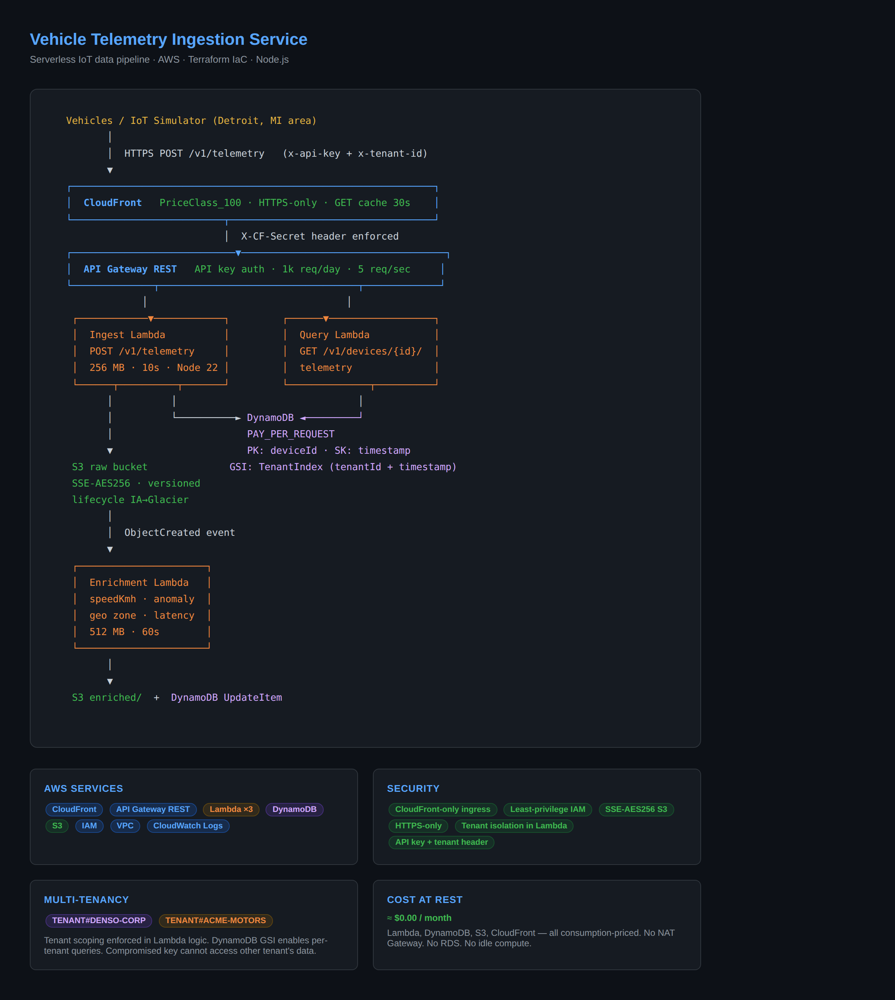
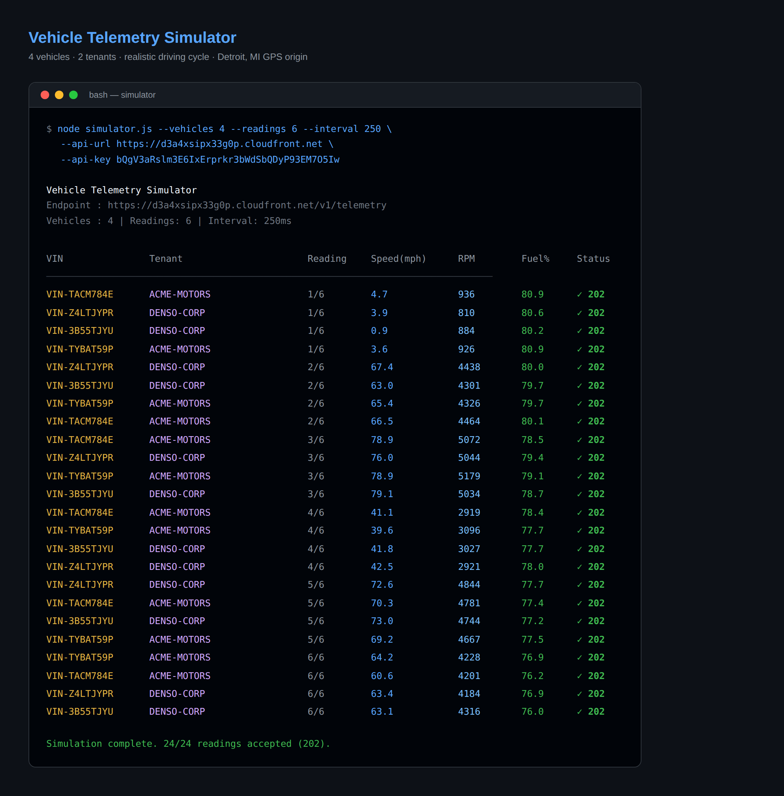
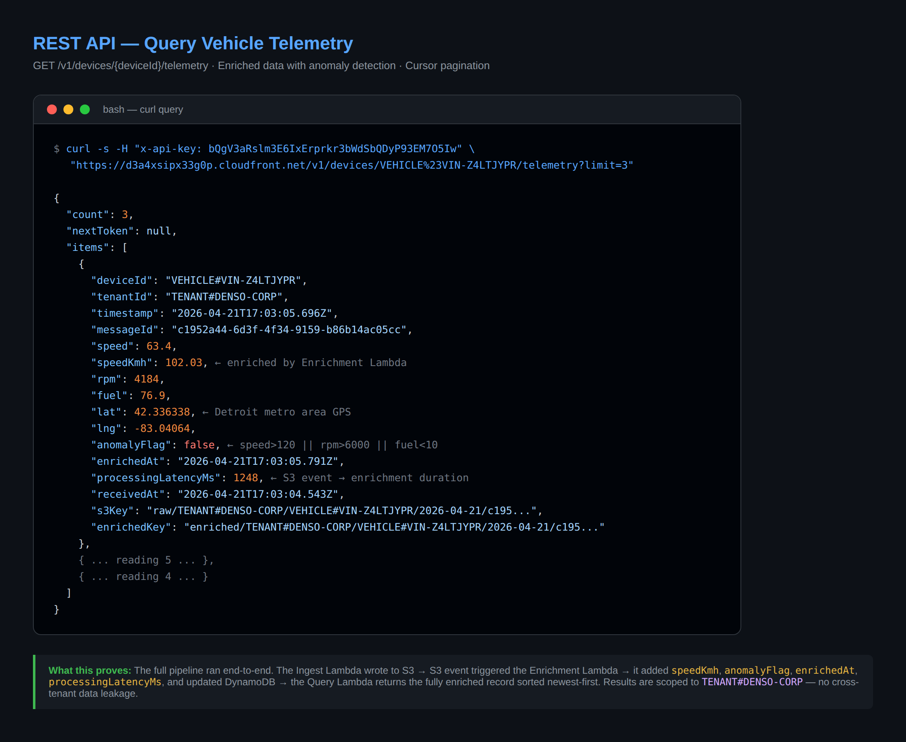
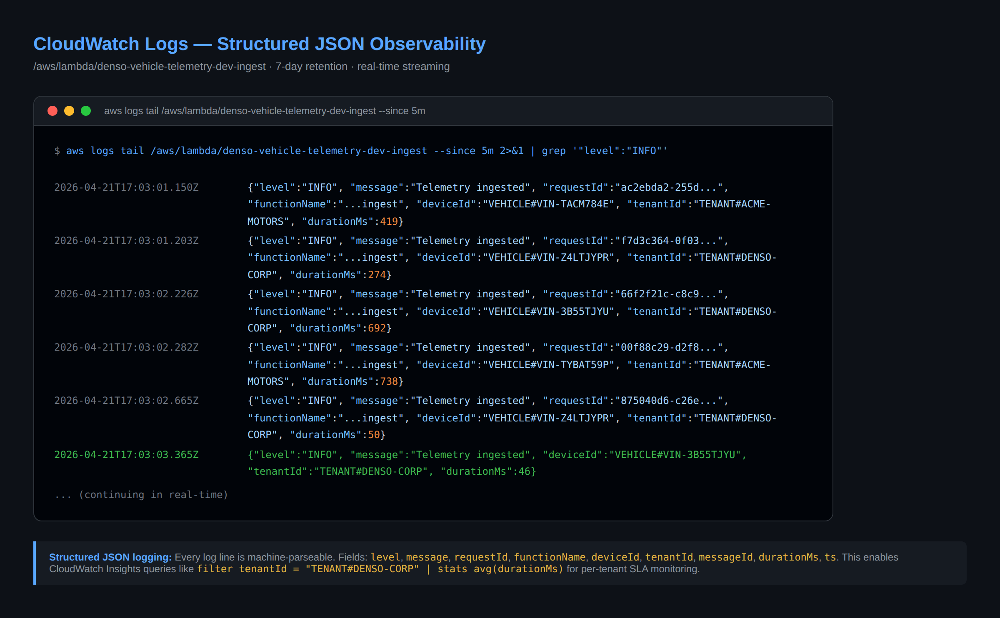
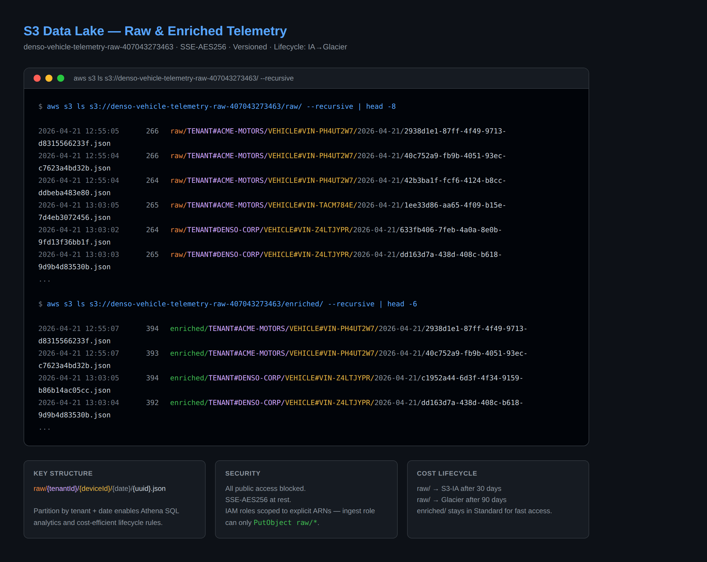
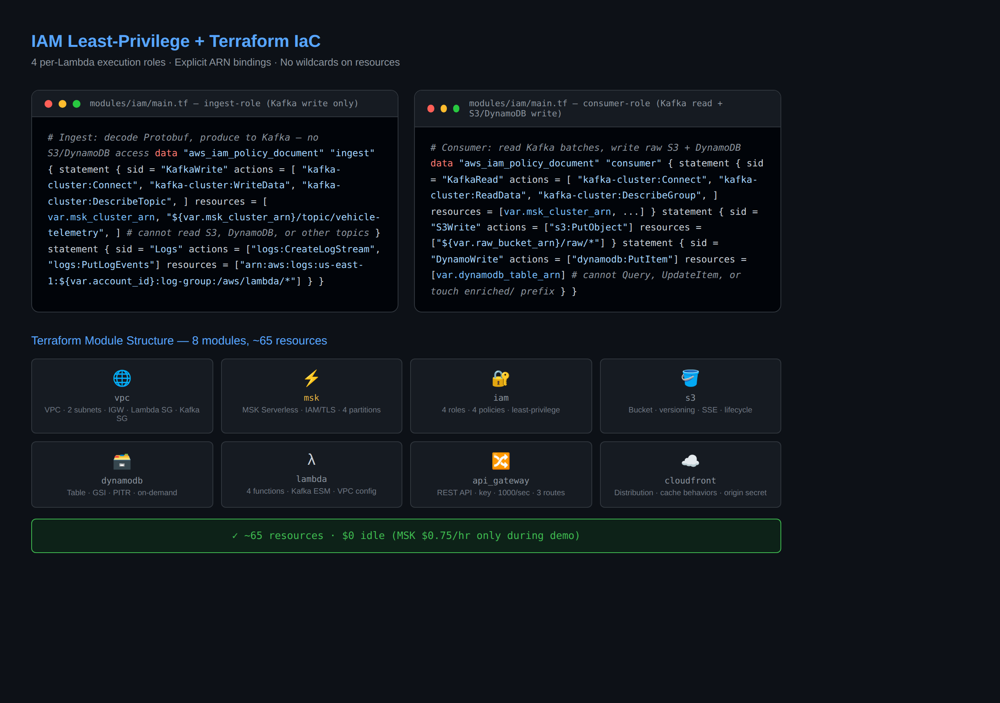

# Vehicle Telemetry Ingestion Service


A serverless IoT data pipeline on AWS that ingests real-time vehicle telemetry from embedded sensors at **1000 req/sec**, buffers through **Apache Kafka (MSK Serverless)** with **Protobuf binary encoding**, stores and enriches data automatically, and serves it via a secure multi-tenant REST API. All infrastructure defined in Terraform.

---

## Architecture

```
  Vehicles / IoT Simulator  (Detroit, MI area GPS)
          │
          │  HTTPS POST /v1/telemetry
          │  Content-Type: application/x-protobuf  (3x smaller than JSON)
          ▼
  ┌────────────────────────────────────────────────────────────────────┐
  │  CloudFront   PriceClass_100 · HTTPS-only · GET cache 30s         │
  └────────────────────────────┬───────────────────────────────────────┘
                               │  X-CF-Secret origin header enforced
  ┌──────────────────────────────▼─────────────────────────────────────┐
  │  API Gateway REST   API key auth · 10M req/day · 1000 req/sec     │
  └───────────────┬───────────────────────────────┬────────────────────┘
                  │                               │
   ┌──────────────▼─────────┐       ┌─────────────▼──────────────────┐
   │  Ingest Lambda          │       │  Query Lambda                  │
   │  POST /v1/telemetry     │       │  GET /v1/devices/{id}/         │
   │  Protobuf decode        │       │       telemetry                │
   │  256 MB · 10s · Node 22 │       └─────────────┬──────────────────┘
   └──────────────┬──────────┘                     │
                  │ Kafka produce (~5ms)            │
                  ▼                                 │
  ┌───────────────────────────────────────────────┐ │
  │  MSK Serverless Kafka                         │ │
  │  topic: vehicle-telemetry · 4 partitions      │ │
  │  PartitionKey = deviceId (ordering per device)│ │
  │                                               │ │
  │  partition 0 ──► Consumer Lambda (250/sec)    │ │
  │  partition 1 ──► Consumer Lambda (250/sec)    │ │
  │  partition 2 ──► Consumer Lambda (250/sec)    │ │
  │  partition 3 ──► Consumer Lambda (250/sec)    │ │
  └──────────────────────┬────────────────────────┘ │
                         │ batch write               │
                         ▼                           │
                    S3 raw bucket  ◄─────────────────┘
                    SSE-AES256 · versioned           DynamoDB
                    lifecycle IA→Glacier             PAY_PER_REQUEST
                         │                          PK: deviceId · SK: timestamp
                         │  ObjectCreated event     GSI: TenantIndex (tenantId + ts)
                         ▼
                  ┌──────────────────────┐
                  │  Enrichment Lambda   │
                  │  speedKmh · anomaly  │
                  │  geo zone · latency  │
                  │  512 MB · 60s        │
                  └──────────────────────┘
                         │
                         └──► S3 enriched/  +  DynamoDB UpdateItem
```

**Horizontal scaling:** add Kafka partitions → Lambda auto-scales to match. 2000 req/sec = 8 partitions, zero code changes.

---

## Protobuf — Binary Encoding

Vehicle telemetry is encoded as [Protocol Buffers](https://protobuf.dev/) before transmission.

```protobuf
// proto/telemetry.proto
message VehicleTelemetry {
  string device_id  = 1;   string tenant_id  = 2;
  string timestamp  = 3;   float  speed      = 4;
  int32  rpm        = 5;   float  fuel       = 6;
  double lat        = 7;   double lng        = 8;
  string message_id = 9;
}
```

| Format | Payload size | At 1000 req/sec |
|---|---|---|
| JSON | ~265 bytes | 954 MB/hour |
| **Protobuf** | **~85 bytes** | **306 MB/hour** |

3x smaller payload · strict schema contract · faster serialization

The simulator prints the comparison on every run:
```
Encoding  : Protobuf 85B vs JSON 265B  (3.1x smaller)
```

---

## Screenshots

### Architecture
[](docs/screenshots/01-architecture.html)

### Simulator — 24/24 Readings Accepted
[](docs/screenshots/02-simulator.html)

### REST API — Enriched Telemetry Response
[](docs/screenshots/03-api-query.html)

### CloudWatch Logs — Structured JSON
[](docs/screenshots/04-cloudwatch-logs.html)

### S3 Data Lake — raw/ and enriched/ Prefixes
[](docs/screenshots/05-s3-data-lake.html)

### IAM Least-Privilege + Terraform Module Map
[](docs/screenshots/06-iam-terraform.html)

---

## Simulator Output

```
Vehicle Telemetry Simulator — Protobuf Edition
Endpoint  : https://d1bsml8igcvc2k.cloudfront.net/v1/telemetry
Vehicles  : 3  |  Readings: 10  |  Interval: 400ms
Encoding  : Protobuf 85B vs JSON 265B  (3.1x smaller)

VIN           Tenant                Reading  Speed(mph)  RPM     Fuel%   Status
--------------------------------------------------------------------------------
VIN-8SCJSPZU  ACME-MOTORS           1/10     4.2         851     80.2    ✓ 202
VIN-5UAKVZEH  FLEET-CORP            1/10     3.7         834     80.8    ✓ 202
VIN-VDDPVHX5  FLEET-CORP            1/10     1.5         828     80.4    ✓ 202
...

Simulation complete. 30/30 accepted (202).
```

Load test (1000 req/sec burst):
```bash
node simulator.js --vehicles 200 --readings 5 --interval 0 \
  --api-url $CF_URL --api-key $API_KEY
```

---

## API Response — Enriched Telemetry

```json
{
  "count": 3,
  "nextToken": null,
  "items": [
    {
      "deviceId":            "VEHICLE#VIN-Z4LTJYPR",
      "tenantId":            "TENANT#FLEET-CORP",
      "timestamp":           "2026-04-21T17:03:05.696Z",
      "speed":               63.4,
      "speedKmh":            102.03,
      "rpm":                 4184,
      "fuel":                76.9,
      "lat":                 42.336338,
      "lng":                 -83.04064,
      "anomalyFlag":         false,
      "enrichedAt":          "2026-04-21T17:03:05.791Z",
      "processingLatencyMs": 1248,
      "s3Key":    "raw/TENANT#FLEET-CORP/VEHICLE#VIN-Z4LTJYPR/2026-04-21/<uuid>.json",
      "enrichedKey": "enriched/TENANT#FLEET-CORP/VEHICLE#VIN-Z4LTJYPR/2026-04-21/<uuid>.json"
    }
  ]
}
```

> `speedKmh`, `anomalyFlag`, `enrichedAt`, and `processingLatencyMs` are added by the Enrichment Lambda, triggered automatically by the S3 `ObjectCreated` event.

---

## CloudWatch Logs — Structured JSON

```json
{"level":"INFO","message":"Telemetry queued","deviceId":"VEHICLE#VIN-Z4LTJYPR","tenantId":"TENANT#FLEET-CORP","messageId":"633fb406","protoBytes":85,"jsonBytes":265,"durationMs":5}
{"level":"INFO","message":"Record stored","deviceId":"VEHICLE#VIN-Z4LTJYPR","tenantId":"TENANT#FLEET-CORP","messageId":"633fb406","s3Key":"raw/..."}
{"level":"INFO","message":"Enrichment complete","deviceId":"VEHICLE#VIN-Z4LTJYPR","anomalyFlag":false,"durationMs":48}
```

Queryable with CloudWatch Insights:
```sql
filter tenantId = "TENANT#FLEET-CORP"
| stats avg(durationMs), count() by bin(5m)
```

---

## IAM — Least-Privilege Roles

Each Lambda has its own execution role. No wildcards on resources.

| Role | Permissions | Cannot |
|---|---|---|
| `ingest-role` | `kafka-cluster:Connect`, `kafka-cluster:WriteData` | Read S3/DynamoDB directly |
| `consumer-role` | `kafka-cluster:ReadData`, `s3:PutObject raw/*`, `dynamodb:PutItem` | Query, Update, Delete |
| `enrichment-role` | `s3:GetObject raw/*`, `s3:PutObject enriched/*`, `dynamodb:UpdateItem` | PutItem, Query, touch other prefixes |
| `query-role` | `dynamodb:Query` (table + GSI) | Write anything, touch S3 or Kafka |

---

## Terraform — 8 Modules · ~65 Resources

```
terraform/
└── modules/
    ├── vpc/           VPC · 2 public subnets · IGW · Lambda SG · Kafka SG
    ├── msk/           MSK Serverless cluster · IAM/TLS auth · 4-partition topic
    ├── iam/           4 execution roles · 4 inline policies · least-privilege
    ├── s3/            Raw bucket · SSE-AES256 · versioning · lifecycle rules
    ├── dynamodb/      Single table · tenant GSI · PITR · PAY_PER_REQUEST
    ├── lambda/        4 functions · Kafka event source mapping · VPC config
    ├── api_gateway/   REST API · API key · usage plan · 3 routes · validator
    └── cloudfront/    Distribution · 3 cache behaviors · CF-only origin secret
```

---

## Key Design Decisions

| Topic | Decision | Why |
|---|---|---|
| Kafka over SQS | MSK Serverless + 4 partitions | SQS 256KB limit hits sensor arrays; Kafka gives replay, ordering per device, and linear horizontal scaling |
| Protobuf over JSON | `proto/telemetry.proto` schema | 3x smaller payload; strict contract catches firmware schema changes at ingest boundary |
| Horizontal scaling | Partition count = consumer count | Add partitions → Lambda auto-scales. 2000/sec = 8 partitions, zero code changes |
| No EKS | Lambda instead | Stateless event-driven workload — Kubernetes adds overhead with no benefit |
| No RDS | DynamoDB on-demand | Access patterns are key-value + time-range; no relational joins needed |
| No NAT Gateway | Lambdas use VPC endpoints | Saves $32/month; ingest/consumer use VPC for MSK access |
| CloudFront + origin policy | Restrict API GW to CF header | Prevents bypassing CDN layer; DDoS shield at no extra cost |
| Single-table DynamoDB | `deviceId` PK + `timestamp` SK | O(1) time-range queries per device; GSI inverts for tenant-scoped ops |

---

## Deploy

**Prerequisites:** Terraform ≥ 1.5 · Node.js ≥ 20 · AWS CLI configured

```bash
# Deploy all ~65 resources (~5-8 minutes, MSK takes longer to provision)
cd terraform
terraform init
terraform apply -auto-approve

# Get outputs
CF_URL=$(terraform output -raw cloudfront_url)
API_KEY=$(aws apigateway get-api-key \
  --api-key $(terraform output -raw api_key_id) \
  --include-value --query value --output text)

# Install simulator dependencies
cd ../simulator && npm install

# Run standard demo
node simulator.js --vehicles 3 --readings 10 --interval 400 \
  --api-url $CF_URL --api-key $API_KEY

# Load test — 1000 req/sec burst
node simulator.js --vehicles 200 --readings 5 --interval 0 \
  --api-url $CF_URL --api-key $API_KEY

# Query a vehicle
curl -s -H "x-api-key: $API_KEY" \
  "$CF_URL/v1/devices/VEHICLE%23<VIN>/telemetry?limit=10"

# Health check (no key needed)
curl -s "$CF_URL/v1/health"

# Teardown — MSK Serverless charges $0.75/hr; destroy when done
terraform destroy -auto-approve
```

---

## Production Roadmap

1. **AWS IoT Core** — MQTT + X.509 certificate-based device auth for embedded ECUs
2. **Amazon Athena** — SQL analytics directly on the S3 data lake; no database to maintain
3. **Cognito + Lambda Authorizer** — JWT-based tenant claims replacing API key auth
4. **KMS CMK** — customer-managed encryption keys for DynamoDB and S3
5. **Kafka Schema Registry** — enforce Protobuf schema evolution across producer/consumer versions
